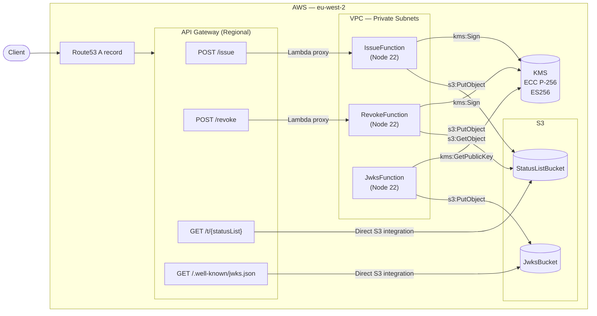

# Mock Status List Infrastructure

This service is a serverless mock of a credential status list, deployed to AWS (eu-west-2) via AWS SAM. 

All compute runs inside a VPC on private subnets. KMS holds the signing key; the private key material never leaves KMS. 
S3 holds the status list JWTs and the JWKS — two of the four API routes read from S3 directly without invoking Lambda.

> **Note:** JwksFunction runs once at startup (not triggered by API Gateway) to populate the JWKS bucket.
> The two direct S3 integrations (defined in `openApiSpec/mock/api-spec.yaml`) bypass Lambda entirely — API Gateway reads from S3 directly.